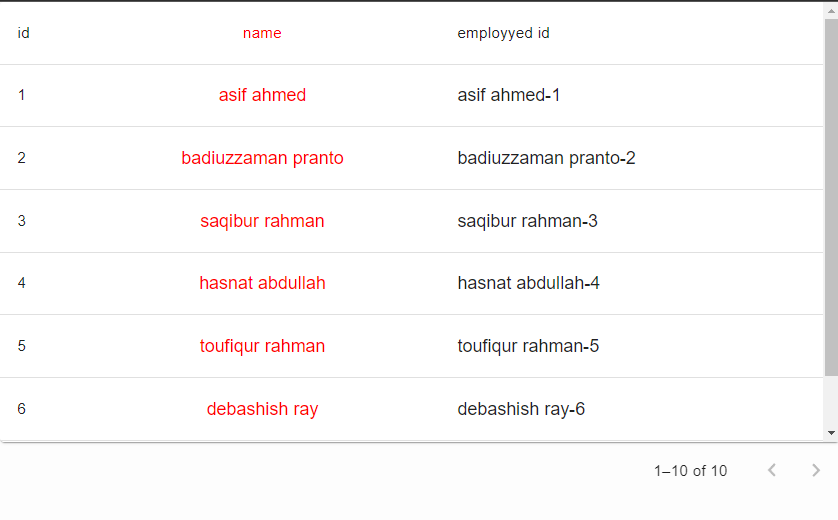
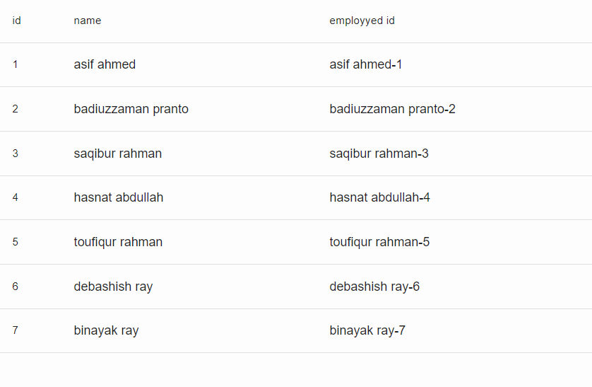

# Ant design inspired reusabale Material Table

Created a reusable **Table** component inspired from ant design which is fully **Customizable** and accepts all **Props** from material ui **Table**

### Preview of table created by this component



## **Basic Table**

**Columns**

### First step - Create a column exacly like we create in ant design.

```
[
    {
      title: "id",
      key: "id",
      dataIndex: "id",
    },
    {
      title: "name",
      key: "name",
      dataIndex: "name",
      render: (name) => {
        return <Typography>{name}</Typography>;
      },
    },
    {
      title: "employyed id",
      key: "employyed_id",
      dataIndex: "",
      render: ({ id, name }) => {
        return <Typography>{`${name}-${id}`}</Typography>;
      },
    },
  ];
```

- **title** represents **Header**
- **key** represent unique key for each **Row**
- **dataIndex** represents the data key we get from response (n.b. dataIndex **empty** means we have access of the full **response** object)

### Final step - Pass **columns** and **Data** to our component.

```
 <Table
      columns={columns}
      dataSource={[
        { name: "asif ahmed", id: "1" },
        { name: "badiuzzaman pranto", id: "2" },
        { name: "saqibur rahman", id: "3" },
        { name: "hasnat abdullah", id: "4" },
        { name: "toufiqur rahman", id: "5" },
        { name: "debashish ray", id: "6" },
        { name: "binayak ray", id: "7" },
      ]}

    />
```

**Done** - Your basic table has been created!! :smile:

**Image of the table**



## **Material Table Props**

We can also pass any **Props** provided by **Material UI** to this component.

**Column**

```
[
    {
      title: "id",
      key: "id",
      dataIndex: "id",
    },
    {
      title: "name",
      key: "name",
      dataIndex: "name",
      configColumn: {
        sx: {
          color: "red",
        },
        align: "center",
      },
      render: (name) => {
        return <Typography>{name}</Typography>;
      },
    },
    {
      title: "employyed id",
      key: "employyed_id",
      dataIndex: "",
      render: ({ id, name }) => {
        return <Typography>{`${name}-${id}`}</Typography>;
      },
    },
  ];
```

By **configColumn** we can pass any **Props** from material ui to our **TableCell**.

**Table Component**

```
<Table
      columns={columns}
      dataSource={[
        { name: "asif ahmed", id: "1" },
        { name: "badiuzzaman pranto", id: "2" },
        { name: "saqibur rahman", id: "3" },
        { name: "hasnat abdullah", id: "4" },
        { name: "toufiqur rahman", id: "5" },
        { name: "debashish ray", id: "6" },
        { name: "binayak ray", id: "7" },
      ]}
      pagination={{
        pageLimit,
        count: 10,
        page,
        handlePageChange,
      }}
      config={{
        tableRow: {},
        tableHead: {},
        tableContainer: { sx: { maxHeight: "400px" }, component: Paper },
        table: {
          size: "medium",
          stickyHeader: true,
        },
        tableBody: {},
      }}
    />
```

By **config** we can pass any **Props** from material ui to our **Table**.

**Image of the table**


## List of props

### **Column**

| Props             | Type     | Description                                               | Return           |
| :---------------- | :------- | :-------------------------------------------------------- | :--------------- |
| title             | `string` | **TableCell** content in **TableHead**                    | -                |
| key               | `string` | Unique key for each **TableCell**                         | -                |
| dataIndex         | `string` | Targeted data key from **response** or data source        | -                |
| render            | `fn`     | Render function for customizing content                   | Custom component |
| `filterComponent` | `object` | Custom component to perform any action to specifiq column | -                |
| configColumn      | `object` | Passes down any props from **Material Ui** Table Cell     | -                |

### **filterComponent**

| Properties     | Type | Description                                    | Return           |
| :-------- | :--- | :--------------------------------------------- | :--------------- |
| component | `fn` | Pass any customize component to perform action | Custom component |

### **Table**

| Props        | Type     | Description                             | Return |
| :----------- | :------- | :-------------------------------------- | :----- |
| Columns      | `arr`    | **Columns** for table                   | -      |
| datSource    | `arr`    | **Data** source of table                | -      |
| `pagination` | `object` | Pagiantion object for paginating table  | -      |
| `config`     | `object` | Render function for customizing content | -      |

### **pagination**

| Properties             | Type     | Description                         | Return                |
| :--------------- | :------- | :---------------------------------- | :-------------------- |
| pageLimit        | `number` | Page Limit of the Table             | -                     |
| count            | `number` | Total data of the Table             | -                     |
| page             | `number` | Current **page** number             | -                     |
| handlePageChange | `fn`     | Render function for navigating page | Navigated page number |

### **config**

| Properties           | Type     | Description                                            | Return |
| :------------- | :------- | :----------------------------------------------------- | :----- |
| tableContainer | `object` | Passing any `props` from Materai Ui's `TableContainer` | -      |
| table          | `object` | Passing any `props` from Materai Ui's `Table`          | -      |
| tableBody      | `object` | Passing any `props` from Materai Ui's `TableBody`      | -      |
| tableHead      | `object` | Passing any `props` from Materai Ui's `TableHead`      | -      |
| tableRow       | `object` | Passing any `props` from Materai Ui's `TableRow`       | -      |
